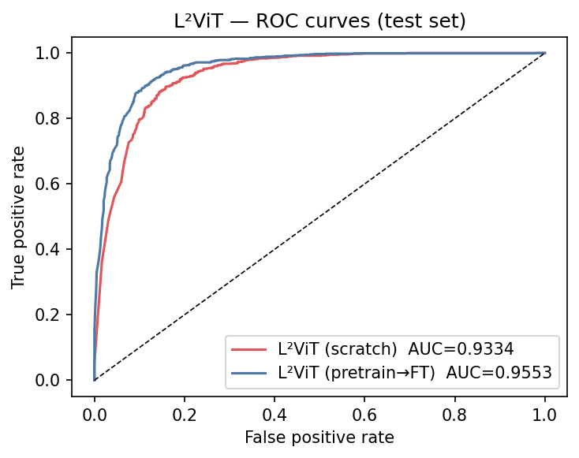
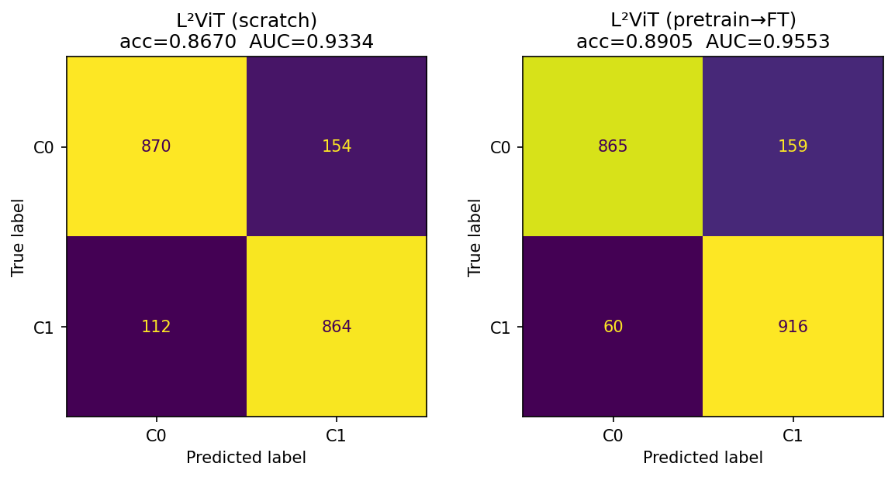
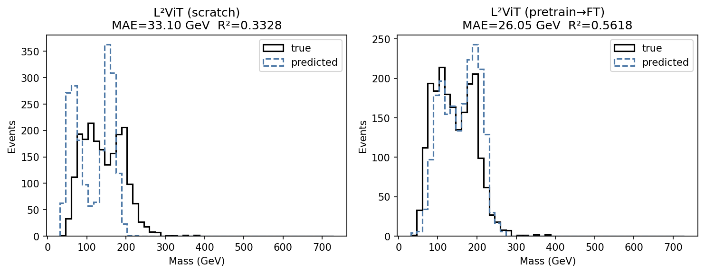
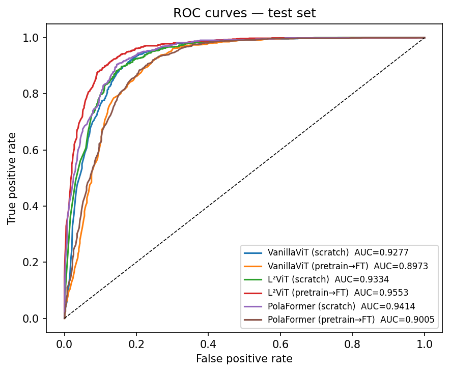
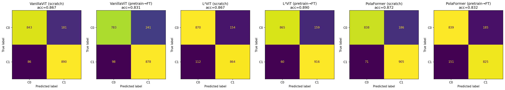
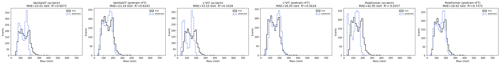
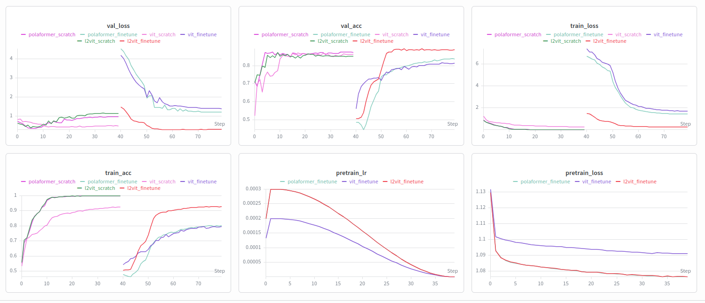

# L²ViT — Linear Attention Vision Transformer for Jet Tagging

**GSoC 2026 · ML4Sci · Task 2h**

End-to-end classification and mass regression on CMS detector jet images using a linear-complexity vision transformer, trained with masked autoencoder pretraining on unlabelled data.

---

## Problem

High-energy physics analyses at CMS produce jet images — 2D calorimeter deposits across 8 detector channels — that need to be tagged by particle type and have their mass estimated. The labelled dataset is small (~10k samples), which makes direct supervised training prone to overfitting on a model of sufficient capacity.

The task asks to: (1) train a linear-scale attention ViT from scratch, (2) pretrain it with self-supervised learning on unlabelled data and finetune with a low learning rate, and (3) compare both regimes on classification accuracy and mass regression.

---

## Approach

**Architecture: L²ViT** — replaces the O(N²) softmax attention in standard ViTs with O(N) linear attention using a ReLU feature map:

```
Attn(Q, K, V) = φ(Q)(φ(K)ᵀV) / (φ(Q) Σφ(K))    where φ(x) = ReLU(x)
```

A **Local Concentration Module (LCM)** — two 7×7 depthwise convolutions on the patch grid — recovers the local spatial structure that linear attention loses. The model has ~7M parameters with a 125×125 input divided into 625 5×5 patches.

A dual output head sits on top of the shared encoder: one branch for binary classification (cross-entropy loss), one for mass regression (L1 loss). Loss balance is auto-calibrated before each run so neither term dominates at initialisation.

**Pretraining: Masked Autoencoder (MAE)** — 40 epochs on 60k unlabelled jet images with mask ratio 0.75. Masking uses energy-weighted sampling (Gumbel trick), biasing toward the high-energy signal patches rather than empty detector background. The pretrained encoder is then finetuned at 10× lower learning rate with the encoder frozen for the first 10 epochs.

Two additional architectures — **PolaFormer** (polar-decomposition linear attention) and **VanillaViT** (standard softmax, baseline) — were trained under the same conditions for comparison.

---

## Results

Evaluated on a held-out 20% test split, stratified by class, never seen during training.

| Model | Accuracy | AUC | MAE (GeV) | R² |
|---|---|---|---|---|
| L²ViT (pretrain → finetune) | **0.8905** | **0.9553** | 26.05 | 0.5618 |
| L²ViT (scratch) | 0.8670 | 0.9334 | 33.10 | 0.3328 |
| PolaFormer (scratch) | 0.8715 | 0.9414 | 42.95 | -0.026 |
| PolaFormer (pretrain → finetune) | 0.8320 | 0.9005 | **18.92** | **0.7372** |
| VanillaViT (scratch) | 0.8665 | 0.9277 | 23.01 | 0.6073 |
| VanillaViT (pretrain → finetune) | 0.8305 | 0.8973 | 23.24 | 0.6243 |

L²ViT finetune wins on classification (AUC 0.9553). PolaFormer finetune has the best regression by a wide margin (MAE 18.92 GeV, R² 0.7372) despite weaker classification — pretraining appears to have pushed its encoder toward mass-predictive features at the expense of class separation. See [`docs/EXPERIMENTS.md`](docs/EXPERIMENTS.md) for analysis.

**L²ViT — Scratch vs Finetune (Task 2h)**

| ROC | Confusion Matrix | Mass Distribution |
|---|---|---|
|  |  |  |

**All models — ROC, Confusion Matrix, Mass Distribution**







**Training curves — all 6 runs (WandB)**



Full L²ViT analysis: [`docs/RESULTS.md`](docs/RESULTS.md)

---

## Quickstart

**1. Install dependencies**
```bash
pip install -r requirements.txt
```

**2. Get the data**

Download from [CERN CERNBox](https://cernbox.cern.ch/s/e3pqxcIznqdYyRv) and place in the repo root:
- `Dataset_Specific_Unlabelled.h5` — 60k unlabelled samples (MAE pretraining)
- `Dataset_Specific_labelled_full_only_for_2i.h5` — ~10k labelled samples (supervised training + eval)

**3. Run the notebook**

Open `l2vit_particle.ipynb`. In **Cell 3**, set `EXPERIMENT` to one of:

| Value | What it runs |
|---|---|
| `"l2vit_finetune"` | MAE pretrain on unlabelled → finetune on labelled |
| `"l2vit_scratch"` | Supervised training from scratch |
| `"polaformer_finetune"` / `"polaformer_scratch"` | PolaFormer variants |
| `"vit_finetune"` / `"vit_scratch"` | VanillaViT variants |

Run all cells top to bottom. **Cell 11** evaluates all checkpoints in `weights/` and generates comparison plots. **Cell 12** shows the focused L²ViT scratch vs finetune comparison for Task 2h.

To skip training and just evaluate, set `EXPERIMENT` to the run you want and jump directly to Cell 11 — it will load from `weights/`.

---

## Repo structure

```
├── l2vit_particle.ipynb        Main notebook
├── requirements.txt
├── weights/                    Saved model checkpoints
│   ├── model_l2vit_finetune.pt
│   ├── model_l2vit_scratch.pt
│   ├── encoder_l2vit_finetune.pt   (MAE pretrained encoder)
│   └── model_{vit,polaformer}_{scratch,finetune}.pt
├── figures/
│   ├── task_2h/                L²ViT comparison plots (Cell 12 output)
│   └── experiments/            All-model eval plots + WandB training curves
└── docs/
    ├── RESULTS.md              L²ViT test results and training analysis
    └── EXPERIMENTS.md          Cross-architecture observations
```

---

## References

1. Zheng et al., *L²ViT: Local-to-Global Vision Transformer with Linear Complexity* (2025) — [arXiv:2501.16182](https://arxiv.org/abs/2501.16182)
2. He et al., *Masked Autoencoders Are Scalable Vision Learners* (2021) — [arXiv:2111.06377](https://arxiv.org/abs/2111.06377)
3. Dosovitskiy et al., *An Image is Worth 16×16 Words* (2020) — [arXiv:2010.11929](https://arxiv.org/abs/2010.11929)
4. ML4Sci GSoC 2026 — [Task 2h description](https://ml4sci.org/gsoc/2026/proposal_DEEPLENSE10.html)
